  <h2>
    Hi, I'm m4dd0c
    
  </h2>
    
As I sip coffee, the keyboard starts smoking and the monitor starts flickering - I think I fried my code <i>and</i> my career.

- 👨💻 All of my projects are available at [https://m4dd0c.me](https://m4dd0c.me)
- ⚡ Fun fact **My code runs better than my social life.**

---

<h3>GitHub Stats:</h3>

|  |  |
| :-----------------------------------------------------------------------------------------------------------------------------------------------: | :------------------------------------------------------------------------------------------------------------------------: |

|  |  |
| :-----------------------------------------------------------------------------------------------------------------------------------------------: | :------------------------------------------------------------------------------------------------------------------------: |

